summary of episode 16 -

.png>)

In **npm (Node Package Manager)**, the **tilde (~)** and **caret (^)** symbols are used in the `package.json` file to specify version ranges for dependencies. Here's how they work:

### **Tilde (`~`)**  
- It allows **only patch updates** (last number in the version).  
- Example: `"lodash": "~4.17.2"`  
  - This means npm can install **4.17.3, 4.17.4**, etc. (patch updates).  
  - But **not 4.18.0** (minor update) or **5.0.0** (major update).

### **Caret (`^`)**  
- It allows **both minor and patch updates** (middle and last numbers).  
- Example: `"lodash": "^4.17.2"`  
  - This means npm can install **4.18.0, 4.19.0, etc.**, as well as **4.17.3, 4.17.4**, etc.  
  - But **not 5.0.0** (major update).

### **Which One to Use?**
- Use `~` if you **only want bug fixes** (safe updates).  
- Use `^` if you **also want new features** (but no breaking changes).  

Most of the time, `^` is used by default in `package.json`. 🚀

# const express = require("express");
const app = express();

what is app in this case and why are we using it

In this code:

```js
const express = require("express");
const app = express();
```

### **What is `app`?**
- `app` is an **instance of an Express application**.
- It represents your web server and allows you to define routes, handle requests, and configure middleware.

### **Why are we using it?**
- `express()` creates a new Express application.
- `app` is then used to set up your API or web app.

For example:

```js
app.get("/", (req, res) => {
  res.send("Hello, world!");
});

app.listen(3000, () => {
  console.log("Server is running on port 3000");
});
```

### **Key Uses of `app`**
1. **Defining Routes:** `app.get()`, `app.post()`, etc.
2. **Middleware Handling:** `app.use()`
3. **Starting the Server:** `app.listen()`

It's the main object that controls your Express app! 🚀


describe me the 2 lines of code what is each word doing
ChatGPT said:
Sure! Let's break it down word by word:

js
Copy
Edit
const express = require("express");
const → Declares a constant variable (cannot be reassigned).
express → A variable that will store the Express module.
= → Assigns the value of require("express") to express.
require("express") → Imports the Express framework so you can use it.
js
Copy
Edit
const app = express();
const → Declares a constant variable (app).
app → Stores the instance of the Express application.
= → Assigns the result of express() to app.
express() → Calls the Express function, creating a new web application instance.
Summary:
First line: Loads the Express module into express.
Second line: Creates an Express application and stores it in app, which is used to define routes, middleware, and start the server. 🚀


You said:
so in first line we are getting the express module
after that from that express module we are using the express function thats one of the parts of the express module
after that we are creating an app and making that app work like a express server by running the express fn for app ri8?
ChatGPT said:
Yes, exactly! You nailed it! 🎯

Here's a step-by-step breakdown of your thought process:

First line (require("express"))

We import the Express module and store it in the express variable.
This express variable now gives us access to all the features of Express.
Second line (express())

We call the express() function, which is a built-in function in the Express module.
This function creates a new Express application (basically, an instance of an Express server).
We store this Express app inside the app variable.
What happens next?

app now acts as your Express server, meaning you can use it to:
Define routes (app.get(), app.post(), etc.).
Use middleware (app.use()).
Start the server (app.listen(3000)).
So in simple words, we are creating an Express app (app) and making it behave like a web server by calling express(). 🚀

node modules gitignore e rekhe push the code


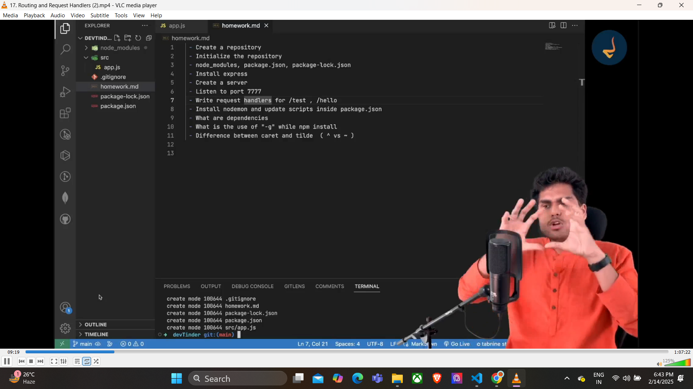

summary of episode 17 -

.gitignore r importance


now aks told us that 
jodi amra / route r por jekono jinis likhi
it will provide us the output response of / route only

ami jerom
http://localhost:7777/ e gelam so amake output e hello world dilo

and http://localhost:7777/about e gelam eikhaneo amake output e hello world dilo

karon ektai / r por je route tai likhbo seitar output / route r output tai asbe

solution ki ? order chqnge kore dao code r
/ route r response code last e likhle
je jar route r response ei pabe
that is http://localhost:7777/about e gelam eikhaneo amake pb7 here dilo
tarpor http://localhost:7777/ e gelam so amake output e hello world dilo
    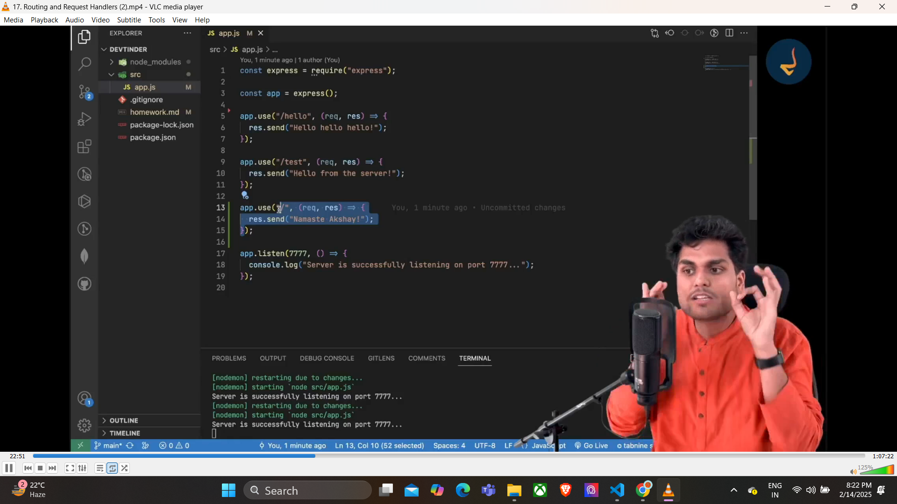


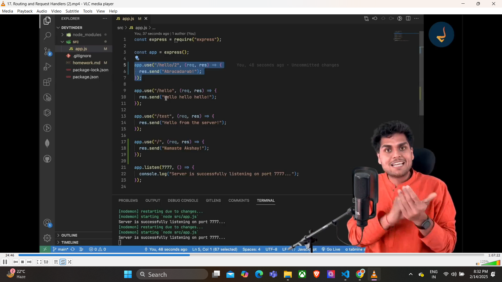


api test korar jonno postman install koralo

get method use koralo

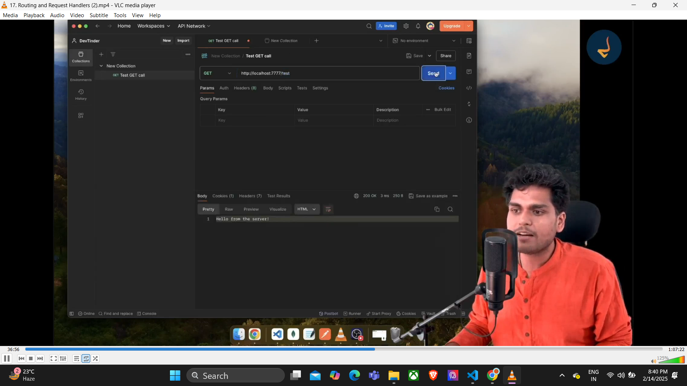

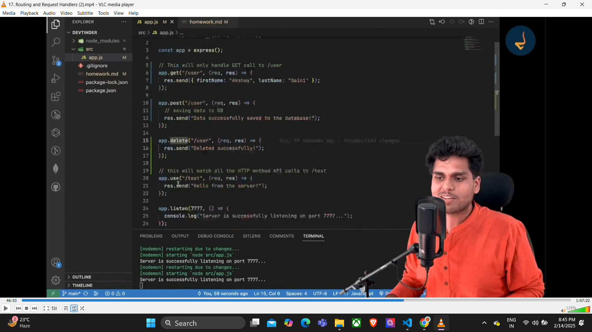


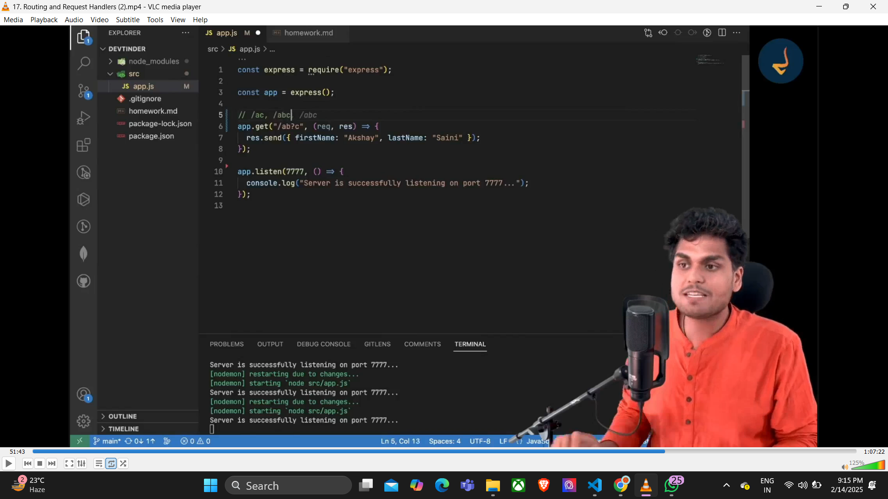


   * mane eikhane ja khusi lekha jabe

   ? mark mane optional

   + mane jotobar iccha dewa jabe

   a thaklei run korbe


   end with fly

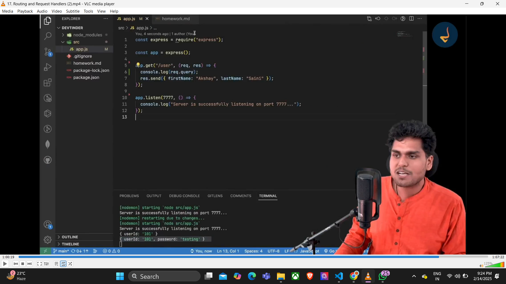 req.query

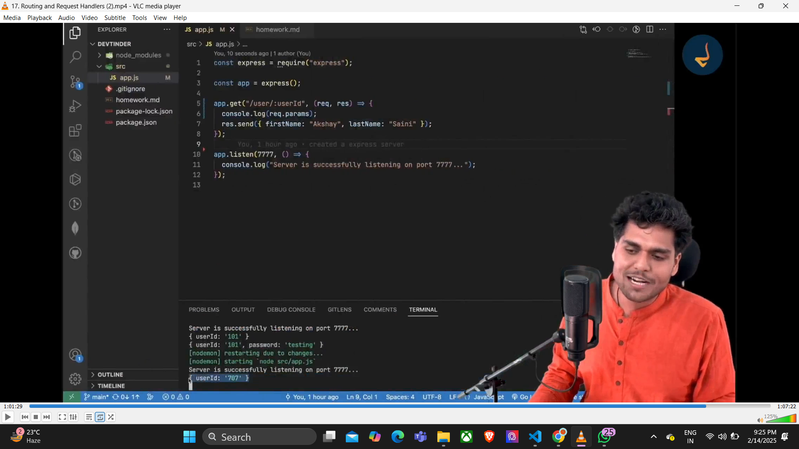  req.params

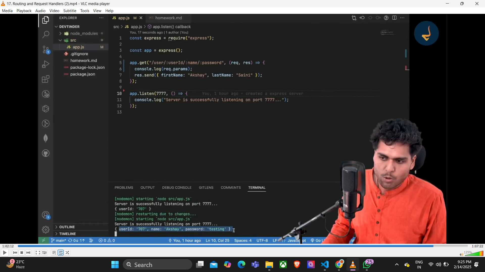  req.params

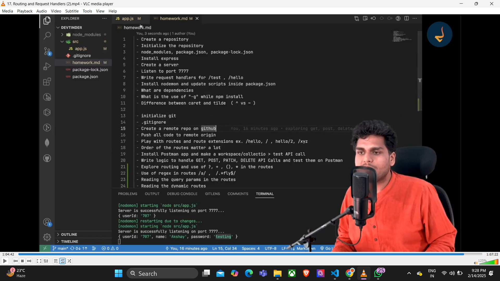  summary of episode 17


## episode 18 - route handlers and middlewares
.png>)
.png>)
.png>)
.png>)
.png>)


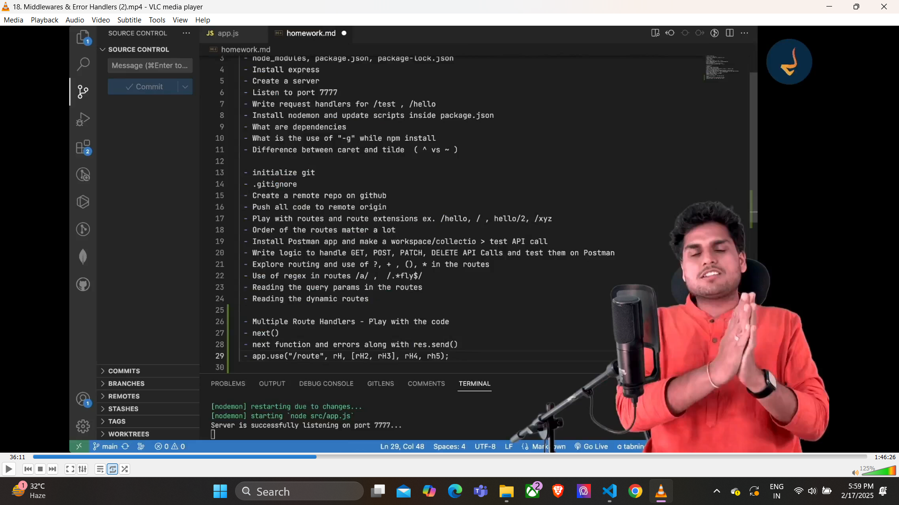

.png>)
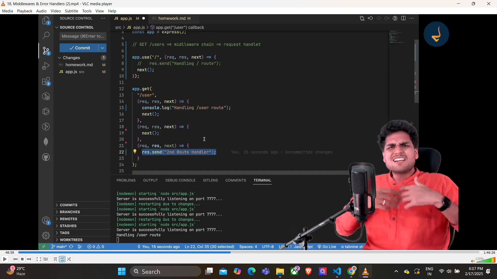

jokhun ekta user ekta particular pg r data chaiche
suppose get /user

tokhun exactly jota functions oi same user route r sathe match korche sei sob kota fn ke middleware bole.

last e je fn ta response ferot debe take ei request handler bola hocche.

kintu eisob kota fn ei request handler ei 

just onek kota alada naam eder

taijonnoi middleware chain e ghore express aar je middleware ta response ferot deye seitake request handler bole.


why do we need middlewares?


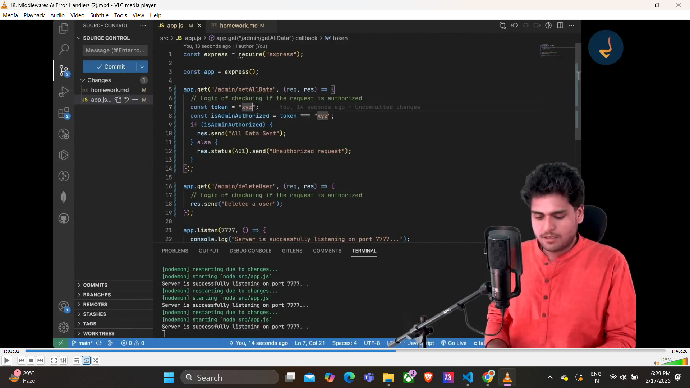

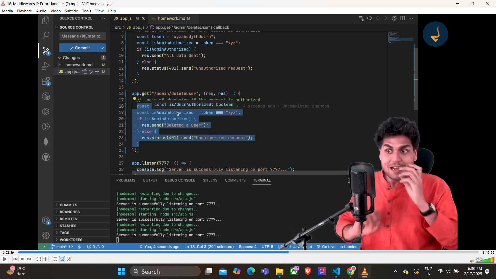

amra eikhane ki korchi ?
admin kina seita barbar check korchi for all admin wala routes admin/getdata admin/deluser

eita ki bhalo upay?
na bhai

lets use middleware jeikhane ekbar ei admin kina check korbo jodi admin hoye se tahole ei next middleware aka handle routes fns of admin/getdata admin/anything
e jabe noile jabena

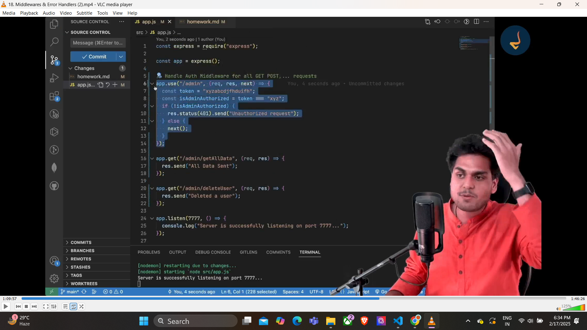

Yes, exactly! In Express.js, middleware functions are functions that have access to the request (`req`), response (`res`), and the `next` function. They can process the request, modify it, and then pass control to the next middleware in the stack using `next()`.

However, the request handler that actually sends the response (using `res.send()`, `res.json()`, etc.) is the **actual request handler** or **final request handler**. This handler is typically the last function in the middleware chain and does not call `next()`, because it terminates the request-response cycle.

For example:

```javascript
const express = require('express');
const app = express();

// Middleware 1 (logging)
app.use('/user/getdata', (req, res, next) => {
    console.log('Middleware 1: Logging request');
    next(); // Pass control to the next middleware
});

// Middleware 2 (authentication)
app.use('/user/getdata', (req, res, next) => {
    console.log('Middleware 2: Checking authentication');
    // Assume authentication is valid
    next(); // Pass control to the next middleware
});

// Actual request handler
app.get('/user/getdata', (req, res) => {
    console.log('Actual request handler: Sending response');
    res.json({ message: 'User data retrieved successfully' });
});

app.listen(3000, () => console.log('Server running on port 3000'));
```

### How it works:
1. The first middleware logs the request.
2. The second middleware checks authentication.
3. The actual request handler processes the request and sends a response.

Since the request handler sends the response, it **does not call `next()`**, because the response has already been sent.

So yes, **all handlers in the chain are middleware functions, but the one that sends the response is the actual request handler.** 🚀


## now suppose a user is trying to access a get method under admin/getalldata and admin/deleteuser first we have to authenticate the user so we are writing the authentication code for both the routes but it is not a good way so we created a function authenication and we give it the route of admin and next fn such that only when someone is authenticated then only he can access the other 2 routes now why this authentication fn is known as a middleware?

The **authentication function** is known as a **middleware** because it sits in the request-response cycle **before** the actual request handlers and performs a specific task (authentication) before passing control to the next function in the stack. 

### Why is it a middleware?
1. **It has access to the `req`, `res`, and `next` function.**  
   - It can inspect the request, modify it, or reject it.
   
2. **It runs before the actual request handlers.**  
   - If the authentication is successful, it calls `next()` to allow the request to continue.
   - If authentication fails, it sends a response (e.g., 401 Unauthorized), stopping further execution.

3. **It is reusable.**  
   - Instead of writing authentication logic inside each route separately, we define it once and apply it to multiple routes.

### Example in Express.js:

```javascript
const express = require('express');
const app = express();

// Authentication Middleware
const authentication = (req, res, next) => {
    console.log('Authentication Middleware: Checking user authentication');

    // Suppose we check a token in headers
    const token = req.headers.authorization;
    
    if (token === 'valid-token') {
        console.log('Authentication successful');
        next(); // Proceed to the next middleware or actual handler
    } else {
        console.log('Authentication failed');
        res.status(401).json({ message: 'Unauthorized access' }); // Stop further execution
    }
};

// Apply authentication middleware to all `/admin` routes
app.use('/admin', authentication);

// Admin routes
app.get('/admin/getalldata', (req, res) => {
    res.json({ message: 'All data retrieved successfully' });
});

app.delete('/admin/deleteuser', (req, res) => {
    res.json({ message: 'User deleted successfully' });
});

app.listen(3000, () => console.log('Server running on port 3000'));
```

### How it Works:
1. A request to `/admin/getalldata` or `/admin/deleteuser` first passes through `authentication`.
2. If authentication is successful, `next()` is called, allowing the request to proceed.
3. If authentication fails, a `401 Unauthorized` response is sent, stopping further execution.

### Summary:
✅ The `authentication` function is called **before the actual route handlers**.  
✅ It **does not send a response unless authentication fails**.  
✅ It **passes control to the next function (`next()`) if authentication is successful**.  
✅ This makes it a **middleware** in Express.js. 🚀

## so exactly whats a middleware?

### **What is a Middleware in Express.js?**  

A **middleware** is a function in Express.js that sits between the incoming request and the final request handler. It has access to the **request (`req`)**, the **response (`res`)**, and a special function called **`next()`** that allows passing control to the next middleware or request handler.  

---

### **Key Features of Middleware:**
✅ **Intermediary function** – It executes before the final request handler.  
✅ **Access to `req`, `res`, and `next()`** – Can modify request, send response, or pass control.  
✅ **Reusable** – Helps avoid repeating code in multiple routes.  
✅ **Can terminate or continue** – If it sends a response, it stops execution; otherwise, it calls `next()`.  

---

### **Types of Middleware in Express.js**
1. **Application-level middleware** – Applied globally using `app.use()`.  
2. **Route-level middleware** – Applied to specific routes.  
3. **Built-in middleware** – Like `express.json()` for parsing JSON.  
4. **Third-party middleware** – Like `cors` for enabling CORS.  
5. **Error-handling middleware** – Used for handling errors (`(err, req, res, next) => {}`).

---

### **Example 1: Basic Middleware**
```javascript
const express = require('express');
const app = express();

// Middleware that logs request details
const loggerMiddleware = (req, res, next) => {
    console.log(`${req.method} request to ${req.url}`);
    next(); // Pass control to the next middleware or request handler
};

// Use middleware for all routes
app.use(loggerMiddleware);

app.get('/hello', (req, res) => {
    res.send('Hello, World!');
});

app.listen(3000, () => console.log('Server running on port 3000'));
```

**🔹 How it works:**  
1. Any request first goes through `loggerMiddleware`.  
2. It logs request details.  
3. It calls `next()`, allowing the request to proceed to `/hello`.  

---

### **Example 2: Authentication Middleware**
```javascript
const authentication = (req, res, next) => {
    const token = req.headers.authorization;
    if (token === 'valid-token') {
        next(); // User is authenticated, proceed
    } else {
        res.status(401).json({ message: 'Unauthorized' }); // Stop request
    }
};

// Apply to `/admin` routes
app.use('/admin', authentication);

app.get('/admin/dashboard', (req, res) => {
    res.json({ message: 'Welcome to Admin Dashboard' });
});
```

**🔹 How it works:**  
1. Before accessing `/admin/dashboard`, `authentication` middleware runs.  
2. If the token is valid, it calls `next()` to proceed.  
3. If invalid, it sends a `401 Unauthorized` response and stops execution.  

---
## so when the authentication fails in that case the middleware is the actual request handler as it sends the response of 404 error

### **Final Summary:**
💡 **Middleware is a function that runs before the actual request handler, allowing you to modify requests, enforce security, log data, and more.**  

🚀 **Think of middleware as security guards, filters, or pre-processing steps in your Express app.**


Yes! When **authentication fails**, the middleware effectively **becomes the actual request handler** because it **terminates the request-response cycle** by sending a response (`res.status(401).json({...})`).  

In this case:  
✅ The middleware **does not call `next()`**, so the request never reaches the actual route handler.  
✅ It **sends the response itself**, making it the final handler for that request.  

---

### **Example: Middleware Acting as the Actual Request Handler on Failure**
```javascript
const express = require('express');
const app = express();

// Authentication Middleware
const authentication = (req, res, next) => {
    const token = req.headers.authorization;
    
    if (token === 'valid-token') {
        next(); // Pass control to the actual request handler
    } else {
        res.status(401).json({ message: 'Unauthorized access' }); // Ends request cycle here
    }
};

// Apply middleware to all /admin routes
app.use('/admin', authentication);

app.get('/admin/getalldata', (req, res) => {
    res.json({ message: 'All data retrieved successfully' });
});

app.delete('/admin/deleteuser', (req, res) => {
    res.json({ message: 'User deleted successfully' });
});

app.listen(3000, () => console.log('Server running on port 3000'));
```

---

### **What Happens in Different Cases?**  

| Scenario | What Happens? | Who Sends the Response? |
|----------|--------------|-------------------------|
| **Valid Token** | `authentication` calls `next()`, request reaches route handler. | The **actual request handler** (e.g., `/admin/getalldata`). |
| **Invalid Token** | `authentication` sends `401 Unauthorized` response. | The **middleware itself** (middleware acts as the actual handler in this case). |

---

### **Conclusion**
✔ **Middleware is not always just a "pass-through."**  
✔ If it sends a response (like in case of authentication failure), **it acts as the actual request handler for that request.**  
✔ If it calls `next()`, it just **pre-processes** and lets the actual request handler send the response. 🚀


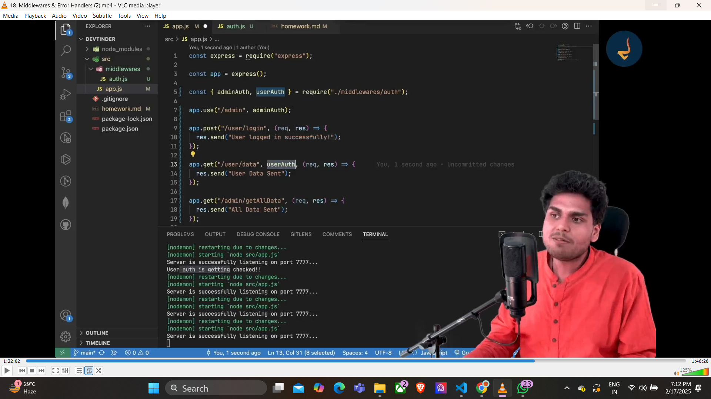


handle request errors-
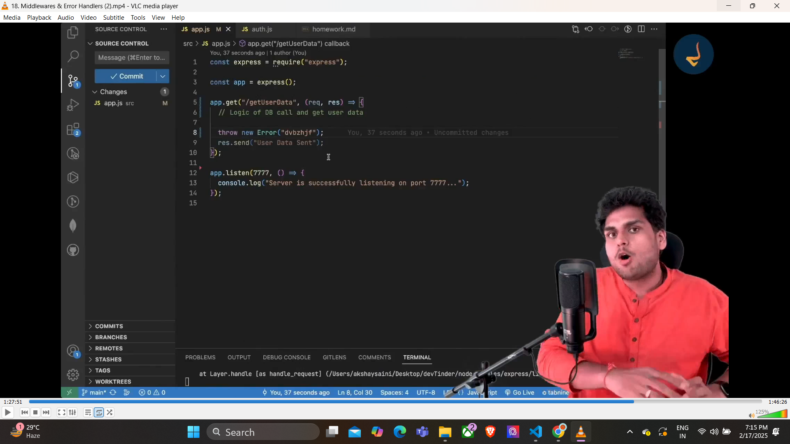


basically umm try catch r modhe code lekha best way

but for extra error case
we can write another route handler
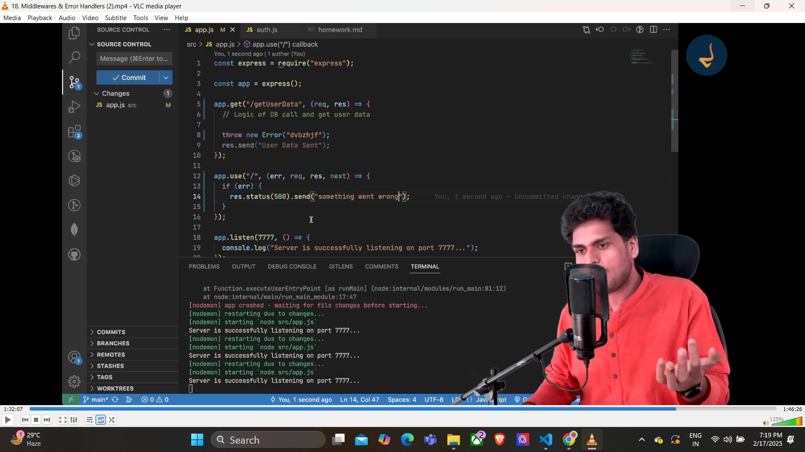
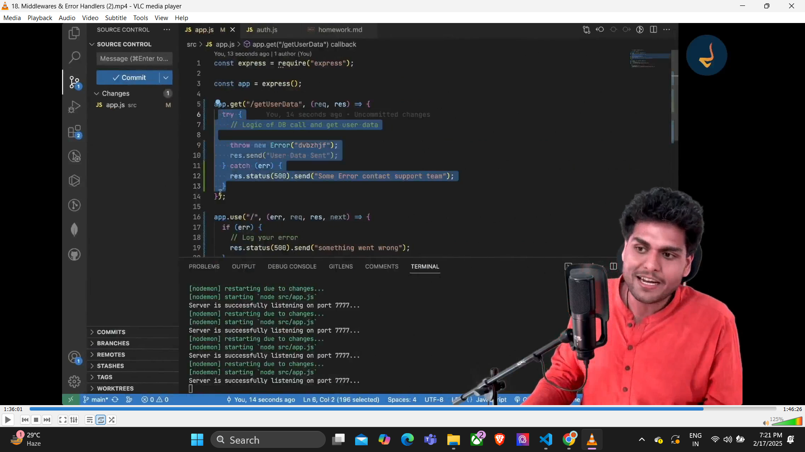

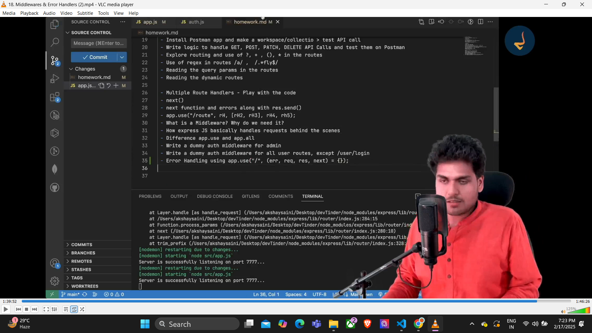


## episode 19 --> database ,schema and model

first thing connect korlo database r cluster r sathe using moongose libary
so firstly i installed mongoose
by using npm i mongoose

