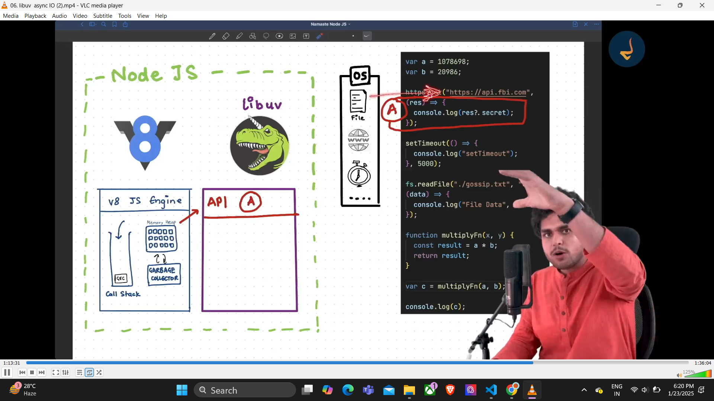
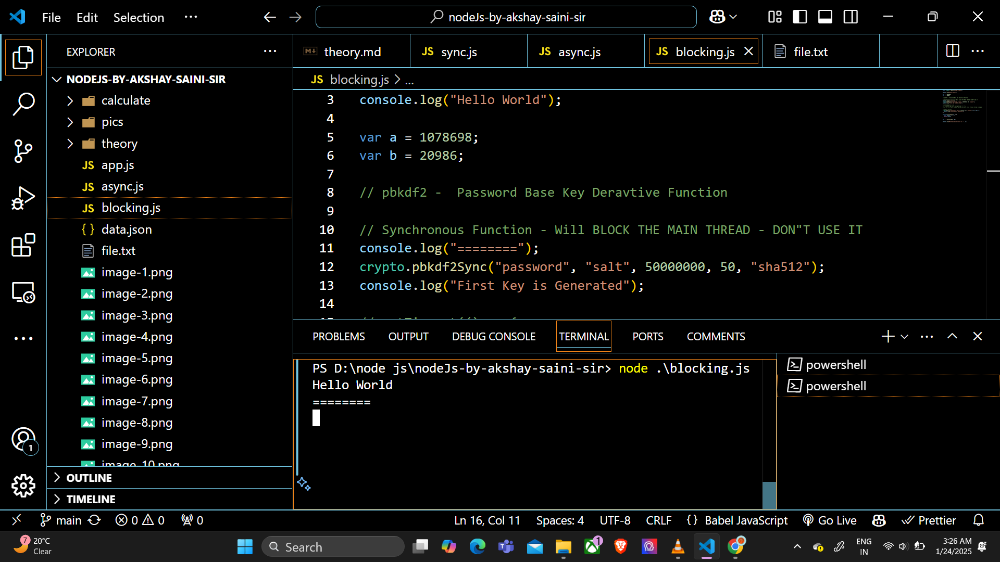
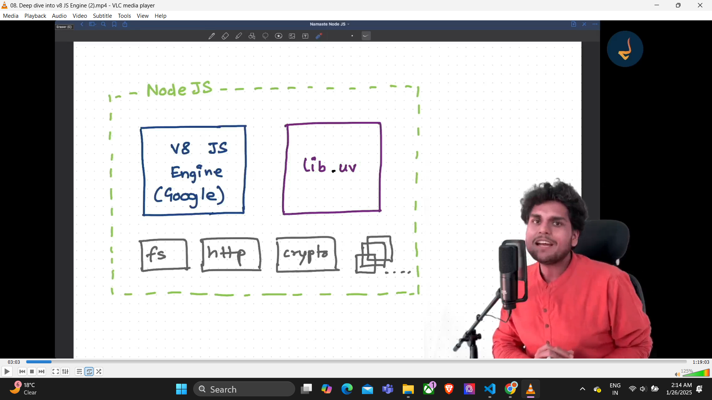

## episode 1 - introduction to node js
node js = Nodejs is basically a Javascript runtime. built on chrome's V8 engine.
Nodejs helps Javascript to run outside the browser 
Nodejs has an event driven architecture that's the specialty of it.
It is capable of asynchronous I/o which is also known as non-blocking i/o.
history of node js-
2009 Ryan Dahl  developed node js
 every code u write in node js code is only js
 js can't run without js engine
 spider monkey firefox js engine was used by ryan at starting 
 after 2 days he switched to chrome's v8 engine
 Joyent company -> internal project -> run js on server
 the company told ryan join us and build this node js with us
 web js naam diyechilo starting e as web server create korbe bole 
 pore node.js naam deye as node js diye onek kichu banano jaye
 question - keno hotat node.js dorkar porlo? apache was used to create http servers which are blocking in nature
so he wanted to create a non blocking server.
advantage of non blocking server is that it can handle multiple requests with lesser no of threads.
npm created by issac came in 2010 = package manager for node 
  2011 e windows support pelo joyent + ms theke as node came in 2009 only for macos and linux
2012 e ryan maintain kora chere dilo tai responsibility pelo isaac
node r development kome gechilo ryan maintain kora stop korar por
2014 e fedor forked node js into io.js in 2014
in 2015 september node js foundation holo node js by joyent + io.js by fedor got merged into  SINGLE/OFFICIAL NODE js
  in 2019 js foundation + node js foundation merged into open js foundation and  open js foundation took  the control of nodejs
  

  ## episode 2 - Js on server
suru
## what is a server?
    server - jekono computer/device jar kache internet ache aar sei device ta programmed(in any programming language) kora in such a way that keu kono request korle ei device ta take response pathabe. erom device ke server bola hoye.
    je mal ta request korche se mal ta jeno internet r sathe connected hoye tarpor request korche.
    dewa newa using internet

  

  

  

  

  

  

  

  

.png>)

## how the internet works in depth
  phone theke data berolo packet hisabe
  tower opdi gelo (majkhane isp check kore je bhai data ta whitelist naki blacklist)
  tower data take electric signal e convert kore
  eibar optical fibre r ghar e chepe data ta pouchabe receiver r kacher tower opdi
  tarpor oi nearest tower theke abar data ta packet rupe convert hoye receiver r device e dhukbe
  this process is the working of internet.

## how the router works in depth
  router - this dabba got my mac address now whenever i msg someone this dabba gets the msg first and delivers it
  and when this dabba receives a msg it send me the msg because it knows my mac address now age ka dine mac address hack kora jeto and akhun hoyena as msg guno encrypted.
  router ta basically ekta dalal jeita amader hoye data transfer korche

## how the internet works normally
 # just a doubt
when i am searching google.com the dns lookup converts the name to the ip adress of google.com and asks whose server for a response ?

When you search for **google.com**, the process involves several steps to reach the correct **Google server**. Here's a breakdown:

1. **DNS Lookup**: 
   - When you type **google.com** in your browser, your computer doesn’t know the exact IP address of that website, so it needs to resolve the domain name to an IP address. This is where the **DNS (Domain Name System)** comes into play.
   - Your device sends a request to a **DNS server** (often provided by your ISP or a third-party service like Google DNS or Cloudflare DNS).
   - The DNS server looks up the IP address associated with **google.com** and returns the result to your device.

2. **Requesting the Web Page**:
   - Once your browser receives the IP address (say, **172.217.9.46**), it knows where to send the request.
   - Your browser then sends an HTTP request (or HTTPS, if using a secure connection) to the **Google web server** identified by that IP address.

3. **Google Server Response**:
   - The request reaches the **Google server** (hosted in a data center somewhere).
   - Google processes the request (e.g., checking your search query) and sends back the response, which is the web page containing search results.

### Who’s Server Responding?
- The **Google web server** that you’re accessing is part of **Google’s infrastructure**, which could be distributed across many data centers around the world.
- The DNS server only helps resolve the domain name to an IP address but does not serve the actual web page. Once your computer has the IP address of Google's server, the browser directly communicates with the **Google server** to fetch the content.

So, in simple terms:
- The DNS server helps find the IP address of **google.com**.
- The **Google server** responds to your request once the IP address is known.

 ## Once your browser receives the IP address (say, 172.217.9.46), it knows where to send the request.
that means whenver i am opening a website that particular website has a own server which is responding 
just like when i serach for google google server responds
same as flipkart amazon

Yes, exactly! Each website typically has its own **server** or a **set of servers** that respond to your requests. Here's how it works for different websites:

1. **Unique Servers for Each Website**:
   - **Google** has its own servers that host **google.com**.
   - **Flipkart** has its own servers for **flipkart.com**.
   - **Amazon** has its own servers for **amazon.com**.

   These servers handle your requests, such as displaying a webpage, processing a search query, or handling a purchase. 

2. **DNS and IP Resolution**:
   - When you type a website's name (like **flipkart.com** or **amazon.com**) into your browser, DNS resolves the domain name to an IP address.
   - Your browser then sends an HTTP or HTTPS request to the server identified by that IP.

3. **Server Response**:
   - Once the server (e.g., Google's server, Flipkart's server, or Amazon's server) receives the request, it processes it and sends back the appropriate response, like the content of the webpage, products, or search results.

### Servers Are Often Distributed:
- **Big websites** like Google, Flipkart, and Amazon typically use **multiple servers** and **content delivery networks (CDNs)** spread across various locations around the world. This helps them handle large amounts of traffic and deliver content quickly to users.
- For example, Google's servers are part of a vast network spread across data centers in different regions. Similarly, Amazon uses a combination of servers to serve millions of users at once.

### In Summary:
- Each website has its own **server or set of servers** that responds to your request.
- The DNS system helps find the correct IP address for that server.
- Once the IP address is found, the browser directly communicates with the server of that specific website (Google, Flipkart, Amazon, etc.) to fetch and display the page.

## difference between http vs https

internet e data dewa newa i.e. data request response http chara hobena
only protocol to surf internet is http
http hocche set of rules(jara internet toiri koreche tara ei rule guno ke baniyeche) jeita follow na korle we cant do internet surfing i.e., data dewa newa
isp- internet service provider ra ei rules guno ke follow korbei

now the difference-->
http e thakle website r data ta ekta hacker read korte parbe this is extremely dangerous

https e thakle website r data ta ekta hacker read korte parbe na as encrypted form e thakbe human readable form e thakbe na

thats why https >> http

## ports-

now server r sathe connection korte gele we need ports.
ports - the places through which we can pass through to connect with the server.
ports are just like gates which allows us to connect with the server.
4-5 digit number like 1234 , 3000.

there are two types of ports open vs closed ports

suppose ami amar barite dhukte chaichi amar barir janla diye whiich is closed that means eita closed port so i cant enter the house using this port

eibar suppose ami ekta mall e dhukte chaichi dorja diye jeita khola ache
tarmane its a open port from which we can enter.

we can choose our own port which is not already running.

## episode 3 - lets write code
install node js
node -v === version of node

npm -v automatically install hoye jaye

node js = ja

vscode installation

## globalThis is the same global object name for all the environments.

## episode 4 - module,export,require

a file is known as module

now amra jokhun onno ekta module r code entry file ie app.js e run korate chai 
tokhun amra require fn ta use kori 
eg 
app.js e -
require("./xyz.js");

xyz.js e-
console.log("pb7 is typing");

output -
pb7 is typing.

a module doesn't leak its fn and variables
but at default ekta module nijer variable fn ke protect kore
so we cant directly access them from app.js 

amader export module korte hobe sei var ba fn ta jeitar access amra dite chai
ebong import korte hobe oi particular var ba fn ta

sum.js file e-
function calculateSum(a, b) {
  const sum = a + b;

  console.log(sum);
  

}

module.exports = calculateSum;

now if we want to export both var and fns we have to use object

first create a package.json file and change the type to module 

tarpor directly export korte parbo
// 2nd way of exporting the function and variable is as shown below

 export function calculateSum(a, b) {
  const sum = a + b;
  console.log(sum);
}
export var p = " Hello Pallab";

// 2nd way of importing the function and variable is as shown below
import {calculateSum,p} from "./sum.js";
var a = 10;
var b = 20;
calculateSum(a, b);
console.log(p);

## akshay saini sir will use old way  common js module for this series
so either package.json uriye debo or
package.json e type = common js kore debo to go bavk to cjs module game of import and export

## non strict mode example -
suppose we are writing a var with giving its type it will run in cjs
eg .   p=20;
console.log(p); //20

but
## strict mode example -
suppose we are writing a var with giving its type it will not run in mjs
eg .   p=20;
console.log(p); // error p not defined

## what is Module.exports - empty object - {}

console.log(module.exports); // empty object

another way of exporting-

module.exports.p=p;
module.exports.calculateSum=calculateSum;

## always export and import as a object for a better code understanding

## create a folder calculate and put the two files sum.js and multiply.js inside it

## imp pattern 
## now the thing is we are importing add fn,multiply fn from different files 
ans -->
so  we want to import them together from the calculate folder itself
how will we do it?

we are gonna create a file index.js and inside this index.js we will import the fns first that we want to import in app.js

after that we are gonna export the index file

and lastly we are gonna import all the fns we need from the index.js file directly

ekta jayega theke sob kota fn import korchi basically

// directly importing all the functions and variables from the index.js file
const {calculateMultiply, calculateSum,p} = require("./calculate/pallab");
// we dont need to write the index.js file name as node will automatically search for the index.js file if we dont write the file name as it will assume its a type of folder import

## // we can keep whatever file name we want index.js is not compulsory
## index.js file name renamed to pallab.js for proving.

# how to import a json file in app.js file

# episode 5 - Diving into the NodeJS Github repo

In this episode, we'll explore how modules actually work behind the scenes. We'll dive into how modules load into a page and how Node.js handles multiple modules, focusing on a deep dive into the
module.exports and require functions

Behind the scenes
In JavaScript, when you create a function…
function x () {
const a = 10;
function b () {
console.log("b");
}
}
Will you be able to access this value? no
console.log(a);
//op - a is not defined 

Q: if u execute this code, will you be able to access it outside the
function?
A:
You cannot access a value outside the function x because it is defined within the
function's scope. Each function creates its own scope, so variables inside a
function are not accessible from outside that function.
To learn more about scope, check out this video: Understanding Scope in
JavaScript.
imp concept ðŸ§
Modules in Node.js work similarly to function scopes. When you require a file,
Node.js wraps the code from that file inside a function. This means that all
variables and functions in the module are contained within that functions
scope and cannot be accessed from outside the module unless explicitly
exported.
To expose variables or functions to other modules, you use module.exports . This allows you to export specific elements from the module, making them
 accessible when required elsewhere in your application.
All the code of a module is wrapped inside a function when you call require .
This function is not a regular function; its a special type known as an IIFE
(Immediately Invoked Function Expression). Heres how it works:
(function () {
 // All the code of the module runs inside here
})();

In this pattern, you create a function and then immediately invoke it. This is
different from a normal function in JavaScript, which is defined and then called
separately:
function x(){}
x();
In Node.js, before passing the code to the V8 engine, it wraps the
module code inside an IIFE. The purpose of IIFE is to:
 Immediately Invoke Code: The function runs as soon as it is defined.
 Keep Variables and Functions Private: By encapsulating the code within the
IIFE, it prevents variables and functions from interfering with other parts of the
code. This ensures that the code within the IIFE remains independent and
private.
Using IIFE solves multiple problems by providing scope isolation and immediate
execution.

# episode 6 - libuv async io

# explain me thread
Single-threaded and Multi-threaded
like a kid

# Alright, imagine your computer is like a pizza delivery shop. The "thread" is like a delivery person who takes pizzas (tasks) from the shop to the customers.

### Single-Threaded:
In a single-threaded shop, you have **only one delivery person**. They take one pizza at a time, deliver it, and then come back to the shop to pick up the next pizza. It works fine if the orders are few and simple. But if one delivery takes a long time, the others have to wait.

- **Example**: You’re playing a video game, and only one thing happens at a time—when you press a button, the game responds one action at a time.

### Multi-Threaded:
In a multi-threaded shop, you have **multiple delivery people**. Each person can take a pizza and deliver it simultaneously. While one is delivering a pizza, another can deliver another pizza to a different customer. It’s much faster and more efficient for handling lots of orders.

- **Example**: You’re using a smartphone. While you're watching a YouTube video, you can also receive notifications and download updates in the background—all at the same time.

### Key Difference:
- **Single-threaded**: One task at a time.
- **Multi-threaded**: Many tasks at the same time.

Threads help your computer work smarter by doing many things at once!

 # A thread is the smallest unit of execution within a process in an
operating system. It represents a single sequence of instructions
that can be managed independently by a scheduler. Multiple
threads can exist within a single process, sharing the same
memory space but executing independently. This allows for
parallel execution of tasks within a program, improving efficiency
and responsiveness.
explain me this like a kid
ChatGPT said:
ChatGPT
Alright, let's break it down super simple:

# Imagine your computer is like a big house where work happens (a process). Inside the house, there are workers (threads). Each worker is doing a job, like cleaning, cooking, or fixing stuff.

Here's how it works:

A thread is like one worker in the house. This worker does a specific job, step by step, following instructions (like cleaning a room or making lunch).

A process is the whole house. It's the big workspace where all the workers (threads) live and do their tasks.

Multiple threads (workers) can work in the same house (process) at the same time, sharing the same tools and space (memory). For example, if one worker is cooking in the kitchen, another can clean the living room.

Since they're working together, they can finish things faster! This is called parallel execution because they’re doing different jobs at the same time.

Why is this useful?
Instead of waiting for one worker to finish everything, you get the job done quicker because many workers help out. Your computer can handle lots of stuff at once, like playing music, running a game, and downloading a file all at the same time!

# thread is basically a kajer lok which executes a small portion of our task(process)

suppose 20 ta dish majhte hobe
kajer masi ekta kore majche otai

eibar js r jonno ekta kajer masi dorkar jar modhe abar v8 engine o cholche
eibar ei kajer masi ta js r ekta kore line execute korbe

 blocking operation
 non blocking operation

js is synchronous but with  nodejs super power it becomes asynchronous

# js doesnt have a concept of time

fec toiri howar time  e heap memory  e result variable store korchi

ar after fec is going out of the call stack the  garbage collector will collect the result variable from the  heap memory 

libuv ke js engine async fn guno diyeche like api call,fs,settimeout
so after ei api call,fs,settimeout r kaj sesh howar por
libuv oi callback fn guno ke v8 engine ke diye bole bhai amar kaj sesh eibar tui execute kor ei callback fn gulo
after executing this callback fns our job is over.

I/O - input output 
ei kaj guno ke input output bola hoye
ei kaj = asynchronous kaj gulo jerom api call, read file aar set timeout fn ei pic e
node js r kache  ei non blocking I/O model ache bolei its famous.

# episode 7 - sync async code settimeout zero code

 # this episode is the code implementation of the previous episode aka 6

if u notice the sync functions like readfilesync doesnt have any callback fns
keno thakbe?
thori na libuv r kaj ache lol

settimeout zero -
setTimeout(() => {
  console.log("call me right now ");
}, 0);

jotoi bolo 0ms e chalao
main call stack phaka na thakle async fn r callback fn run korbe na sona

# episode 8 - how v8 engine works - behind the scenes

when our code's ast cant be generated then we get syntax error

# episode 9 - libuv 

asynchronous aar non blocking io is possible due to libuv

callback fn gulo libuv r callback queue te output niye ferot ese bose thakbe

eibar event loop r kaj holo check kora v8 engine r call-stack free naki busy aar check kora callback queue te kono callback fn pore ache kina

jodi v8 r call-stack busy thake callback fn guno bosei thakbe wait kore

jokhun v8 engine r call-stack free hobe event loop seita lokkho kore callback fn take callstack push kore execute korbe

time wala callback gulo like setTimeout gets the 1st priority ie timer phase e execute hoye

async callback fn gulo 2nd priority paye ie poll phase

set immediate callback fn 3rd priority paye

close phase e je fn gulo close ba stop hocche seiguno priority paye
eg socket close

internal loop ta every phase r age run kore

so basically age ei internal loop ta run korbe after that timer phase chole tarpor abar
ei internal loop ta run korbe after that poll phase cholbe tarpor abar
ei internal loop ta run korbe after that check phase cholbe tarpor abar
ei internal loop ta run korbe after that close phase cholbe 

ei jinis ta continuously repeat hobe 

# ei event loop r bhetore loop duto tokhun ei run korbe jokhun callstack empty thakbe

